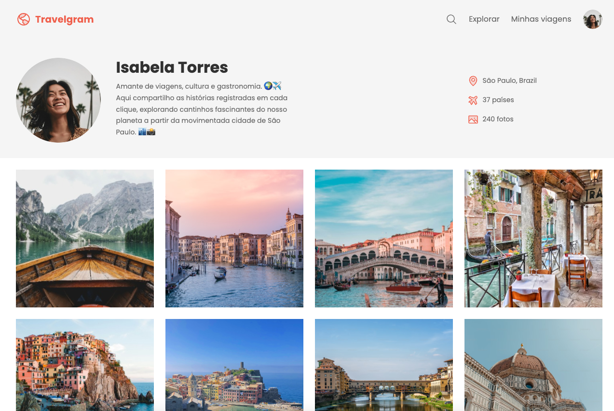

# 🌏 Travelgram

Travelgram is a simple web application that allows users to share and explore travel photos from around the world. This project was developed using only **HTML** and **CSS**, focusing on building a visually appealing.

🔗 **[Live Preview](https://eugeniobarrosjr.github.io/travelgram/)**

## 📸 Preview

<p align="center">
  
</p>

## ✈️ About the Project

Travelgram is a platform that connects travelers, enabling them to share their experiences through photos and descriptions. The application features a clean and intuitive interface, showcasing the power of HTML and CSS for creating engaging web pages.

### Features

- Photo gallery with descriptions
- Responsive and user-friendly design
- Modern layout with CSS styling

## 📂 Getting Started

To run the project locally:

```bash
# Clone the repository
git clone https://github.com/eugeniobarros/travelgram.git

# Navigate to the project directory
cd travelgram

# Open the index.html file in your browser
open index.html
```

## 📃 License

This project is licensed under the MIT License.
